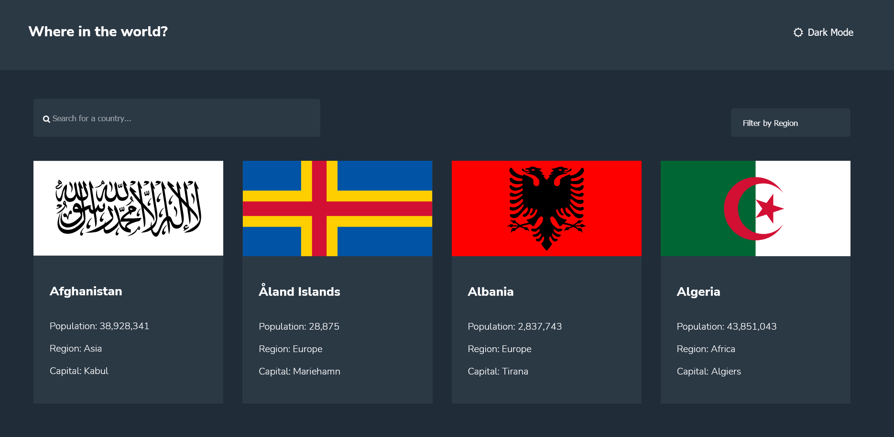

# Frontend Mentor - REST Countries API with color theme switcher solution

This is a solution to the [REST Countries API with color theme switcher challenge on Frontend Mentor](https://www.frontendmentor.io/challenges/rest-countries-api-with-color-theme-switcher-5cacc469fec04111f7b848ca). Frontend Mentor challenges help you improve your coding skills by building realistic projects. 

## Table of contents

- [Overview](#overview)
  - [The challenge](#the-challenge)
  - [Screenshot](#screenshot)
  - [Links](#links)
- [My process](#my-process)
  - [Built with](#built-with)
  - [What I learned](#what-i-learned)
  - [Continued development](#continued-development)
  - [Useful resources](#useful-resources)
- [Author](#author)

## Overview

### The challenge

Users should be able to:

- See all countries from the API on the homepage
- Search for a country using an `input` field
- Filter countries by region
- Click on a country to see more detailed information on a separate page
- Click through to the border countries on the detail page
- Toggle the color scheme between light and dark mode *(optional)*

### Screenshot

### Links

- Live Site URL: [View live page here](http://rest-country-api-eight.vercel.app/)

## My process

### Built with

- [React](https://reactjs.org/) - JS library
- CSS
- Flexbox
- CSS Grid
- Mobile-first workflow

### What I learned

It's the second project ever made in React and the first working with external data, 
it has not been easy for me, the overall experience taught me what i believe is the 
most valuable skill that makes the process easier and enjoyable: A better understanding of what
is involved since the beginning.

My plan started with a "User Story" (brain storming) to determine the core features,
followed by the list of features and a little scheme. I soon realized my plan lacked of clarity
due to my inexperience, my mental model was too close to the user point of view and i wasn't able to 
see upfront how tricky were some parts of the challenge! 

With that being said, definetely i will approach the next project with more knowledge asking myself 
better questions, also i will be more careful when dealing with an API, checking the data first is a must,
as well as taking some time to focus on the data that needs more attention because it's crucial for implementing
a complex task. 

### Continued development

There's so much more about React and its ecosystem, i'd like to know more code structures and decide 
what's the best way to go based on the project. I'm interested in learning React styled components as well. 

### Useful resources

- The search and filter were two independent components, i figure out how to implement them but they had to be in the main page,
  i didn't know how to put them together in just one component and develop the business logic in the page [This blog post](https://www.freecodecamp.org/news/search-and-filter-component-in-reactjs/) helped me to achieve what i wanted.

- [This tutorial](https://getflywheel.com/layout/sticky-back-to-top-button-tutorial/) helped me with the back-to-top button.

- Styling select element was harder than i thought, i could do it thanks to this [CSS trick example](https://css-tricks.com/styling-a-select-like-its-2019/)

## Author

- Frontend Mentor - [@Da-vi-de](https://www.frontendmentor.io/profile/Da-vi-de)